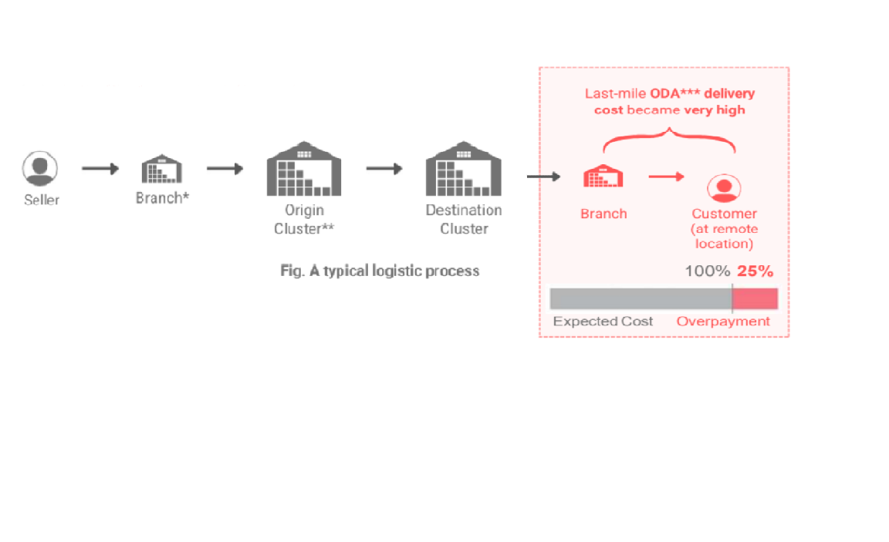

# Optimizing-Last-Mile-Delivery-Planning-for-Cost-Reduction

A logistics company's last mile process became inefficient. The cost of delivering package to remote areas exceeded expected amount by 25%. Resulting in overpayment to partners led to a decrease in profitability. I Analyzed data on current delivery process and Provided recommendation for process improvement based on data insights.

### Objective 

* Find why the cost has become high and what was its impact on the payouts of the partners. 
* Calculate payouts to be given to the partners for making deliveries in the current month.
* Improve the current process to reduce the cost even further.

### Approch 

| Steps| Finding & Impact|  
|----------|----------|
|Understood the process of delivering consignments to ODA (Outskirt delivery Area) areas | On any given day, a last-mile delivery partner can make only 2 trips |
|Checked if partners followed the process established for making deliveries in ODA areas | In ~95% of clusters, partners are violating the process|
|Calculated current payouts to be made to the partners | The report for finance team for releasing current payouts to the partners|
|Analyzed the impact of process violation on the payouts to the partners | Payouts to partners was 20% more than expected |
|Reduced the cost further by making improvements to the current process | Cost could be further reduced by ~27% |

  
